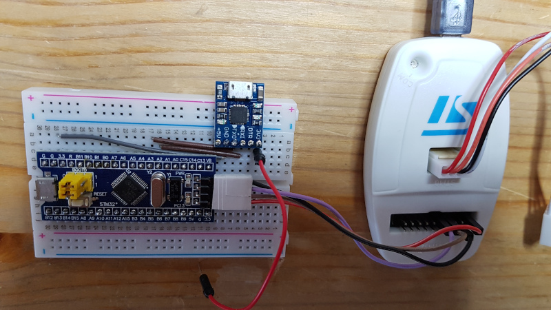

# serial2keyb-byline

Blue Pill STM32F103C8 serial to USB keyboard sends keystrokes line by line.

This is a very simple serial to USB keyboard. It just sends entire line from serial input and emulates USB keyboard.

See also [serial2keyb](https://github.com/asjadenet/serial2keyb)

